# Me

I'm a cybersecurity student.

I enjoy reverse engineering, systems programming, and compiler creation.

# Achievements

[CVE-2026-22592](https://github.com/gogs/gogs/security/advisories/GHSA-cr88-6mqm-4g57) : DoS in repository mirror sync on [gogs](https://github.com/gogs/gogs)

# Badges

<!-- my-badges start -->

<!-- my-badges end -->

